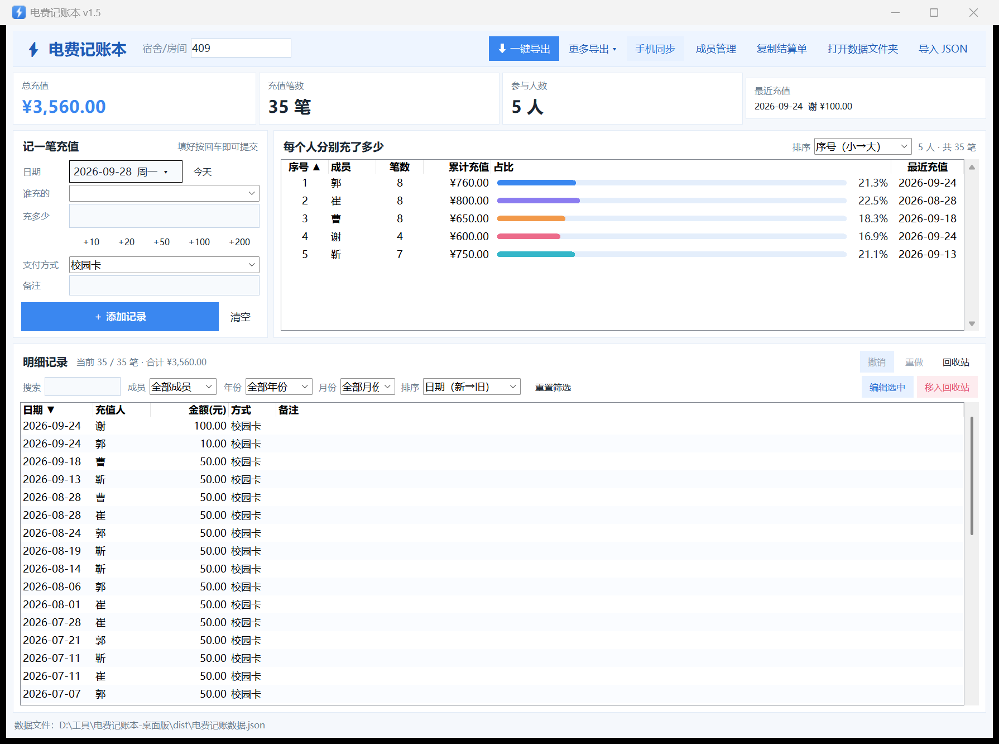
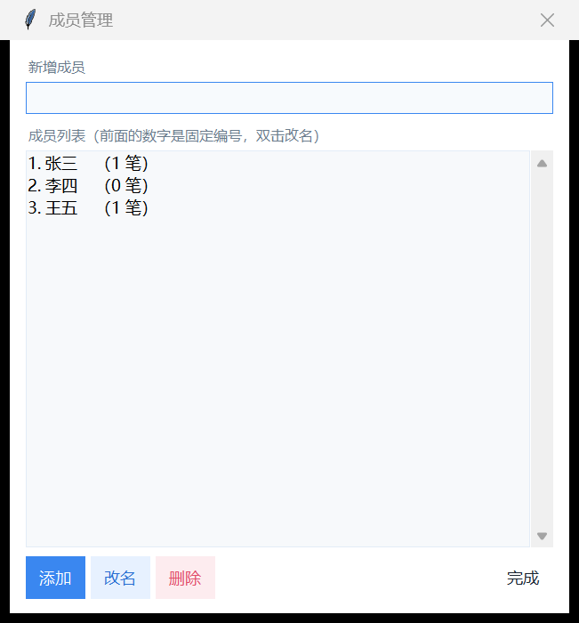
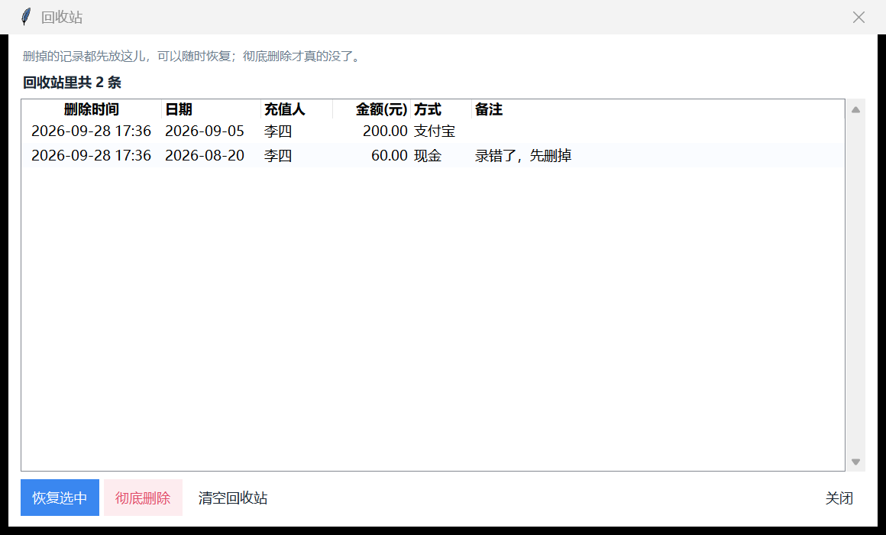

# 电费记账本 · FeeNote

宿舍电费记账工具，**两端都开源**：一个跑在电脑上的桌面版，一个装手机上的安卓版。
数据全部存在自己设备上，**不联网、不上传、不需要账号**；两端的账本可以互相同步。

> **装好就是空账本。** 应用不带任何预置数据 —— 房间号和室友由你自己填，
> 谁装都是干净的一份，不会看到别人的账目。



---

## 一、两个端

| | 桌面版 | 安卓版 |
|---|---|---|
| 位置 | [`desktop/`](desktop/) | [`android/`](android/) |
| 形态 | Python + Tkinter 打包的**单文件 exe** | Kotlin + Jetpack Compose，APK |
| 装什么 | 双击就能跑，零依赖 | Android 8.0 及以上 |
| 数据 | 同目录下的 `电费记账数据.json` | 应用私有目录里的 SQLite |
| 适合 | 平时记账、对账、导出报表 | 随手记一笔、群里问「谁还没交」 |

**共同点**：同一套配色（清透天蓝 + 白色闪电）、同一套 JSON 交换格式、
同一套「软删除进回收站 + 快照式撤销」的操作手感。会用一个就会用另一个。

<p align="center">
  
  
</p>

---

## 二、能干什么

- **记一笔充值**：谁交的、交了多少钱、什么时候、什么方式、备注
- **每人累计**：一眼看出谁交得多、谁还欠着，带占比进度条
- **结算单**：一键生成文本，直接粘到宿舍群里
- **导出**：TXT 文本 / Excel(.xlsx) / CSV / JSON 备份
- **成员管理**：加人、改名（历史记录跟着改）、删人（记录进回收站，可还原）
- **回收站**：删除永远是软的，单条恢复 / 彻底删除 / 一键清空
- **撤销 / 恢复**：任何操作都能一步步退回去，退多了还能再回来
- **查重**：万一两边各自手输了同一笔，「同人 + 同日期 + 同金额」会被挑出来
- **两端同步**：局域网直连（同一个 WiFi 点一下）或 JSON 文件互传

---

## 三、下载

去本仓库的 **Releases** 页面，每个版本都挂了对应的产物：

| 文件 | 装在哪 |
|---|---|
| `feenote-desktop-vX.Y.exe` | Windows 电脑，双击运行（不用装 Python） |
| `feenote-vX.Y-debug.apk` | 安卓手机，点开安装（首次要允许「安装未知应用」） |

文件名用英文是为了跨系统下载不乱码，下下来想改成「电费记账本.exe」也随便改，不影响运行。

历史版本也都留着，想用旧版直接下对应的那一份。

---

## 四、两端怎么同步

两条路，任选：

### 1. 局域网直连（推荐）

同一个 WiFi 下，电脑点顶栏「手机同步」→「启动服务」，会显示 **服务地址** 和 **4 位配对码**；
手机填进去点一下就对完账。

- 支持**两个方向分开执行**：「同步到手机」（电脑 → 手机，只读电脑）和「同步到电脑」（手机 → 电脑，按 uid 合并）
- 一端删掉的记录，另一端会**跟着进回收站**（不是销毁，还能恢复）
- 同步**动手前会先预演一遍**，发现有「疑似同一笔」会先把它们列出来问你怎么办
- 用得越久越安全：所有请求都要带对配对码，不对一律 403；数据不出局域网

### 2. JSON 文件互传

电脑「更多导出 ▾ → 导出 JSON 备份」，传到手机导入；或者反过来。
适合不在同一个网、或者想留个存档的时候。两端用的是**完全一样的格式**，
靠每条记录上的 12 位 `uid` 去重，所以两种方式可以混着用，不会把账记成两份。

---

## 五、仓库结构

```
feenote/
├── desktop/            桌面版（Python + Tkinter，零第三方依赖）
│   ├── 电费记账本.py        主程序
│   ├── 测试.py             测试套件（339 项）
│   ├── 生成图标.py          纯标准库生成 app.ico
│   ├── 检查布局.py / 验收导出.py / 验证exe.py
│   ├── app.ico
│   ├── 示例数据/            空账本模板
│   └── 截图/
└── android/            安卓版（Kotlin + Jetpack Compose + SQLite）
    ├── app/src/main/        源码
    ├── app/src/test/        单元测试（69 项）
    └── tools/               和桌面版联调的端到端脚本
```

各自的用法、构建方式、踩过的坑都写在 `desktop/README.md` 和 `android/README.md` 里。

---

## 六、技术上的两个小坚持

**1. 桌面版零第三方依赖。** 只用 Python 标准库 —— 连导出 `.xlsx` 都是手写 OOXML，
不引入 `openpyxl`。因为目标是「拿到 exe 谁都能跑」，多一个依赖就多一道门槛。

**2. 能单测的逻辑，一律不碰数据库。** 安卓版里 `Repository` 依赖 SQLite（在 JVM 上跑不起来），
所以同步预演、撤销栈、首次引导判断这些纯逻辑被抽成独立的 `object` / 泛型类，
在 JVM 上直接跑（合计 69 项）。桌面版同理，界面层和数据层是分开的，测试不需要显示器。

---

## 七、许可

[MIT](LICENSE) —— 随便用、随便改。
